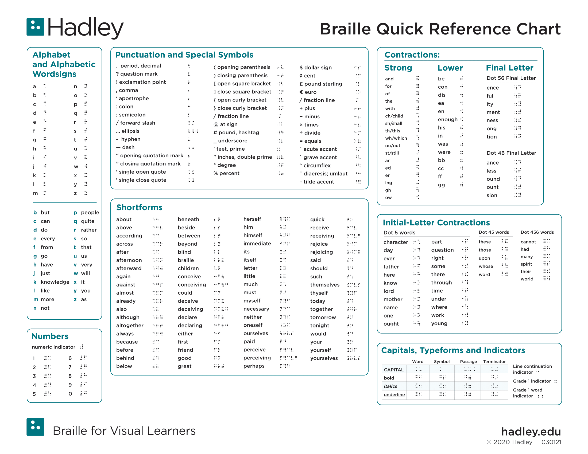

# Braille Printer Daemon

Takes in requests from various interfaces and runs the Raspberry PI's GPIO pins
accordingly.

Will be prototyped in Python using CircuitPython and daughter board libraries provided by Adafruit.
Future work may include porting that functionality to C.

Requires [Adafruit's CircuitPython Motor Kit library](https://docs.circuitpython.org/projects/motorkit/en/latest/), which has
it's own set of dependencies.

## Using the Code

On the Pi, the main.py runs in a virtual environment with all dependencies. To use:

```bash
source daemon-venv/bin/activate
python3 main.py
```

Will use the [wiringpi](https://github.com/WiringPi/WiringPi) or [lgpio](https://abyz.me.uk/lg/lgpio.html) library to use the GPIO pins.

## Braille

The braille alphabet, for reference:


Common braille contractions and punctuation, for reference:


